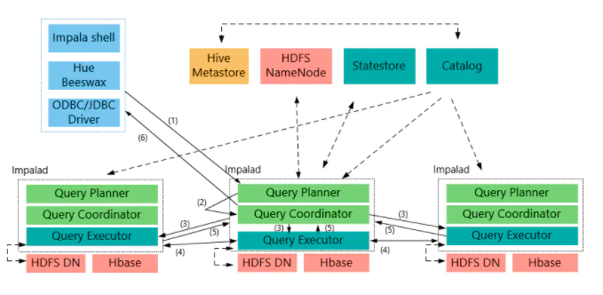

## Impala

impala提供对HDFS、Hbase数据的高性能、低延迟的交互式SQL查询功能。基于Hive使用内存计算，兼顾数据仓库、具有实时、批处理、多并发等优点。

<!-- more -->

### Impala的优点

- 基于内存计算

- 不使用MR

- C++编写计算层，Java编写编译层

- 兼容大部分HiveSQL

- 支持数据本地计算

- 可以使用Impala JDBC访问

### Impala的缺点

- 对内存依赖很大
- 完全依赖Hive
- 只能读取文本文件，不能读取二进制文件
- 在Impala更新的数据会同步到Hive，但是在Hive更新的数据不会自动同步到Impala

### Impala和关系型数据库的异同

- Impala不支持事务和索引
- Impala可以管理PB级数据，但是关系型数据库只能管理TB

### Impala和Hive的异同

- 使用HDFS，HBase储存数据
- 使用相同的元数据
- 使用类似的SQL词法分析生成执行计划
- Impala生成执行计划树，Hive会生成MR模型
- Impala使用拉的方式，后续节点主动拉取前面节点的数据，是流， Hive使用推的方式，前面的节点执行完成后会将数据主动推送给后面的节点

### Impala的架构

Impala集群有三个重要的组件，他们分别是Impala Daemon, Impala Statestore和Impala Metastore



#### Impala Daemon

Impala Daemon（Impalad）在安装Impala的每个节点上运行, 接受来着各种接口的查询，当一个查询提交到某个Impala Daemon的时候，这个节点就充当协调器，将任务分发到集群

#### Impala State

Impala State负责检测每个Impalad的运行状况，如果某个Impala Daemon发生了故障，则这个消息会被通知到所有其他Impla Daemon

#### Impala Matestore

Impala Matestore储存表的元数据信息


### Impala语法

- 时间函数【时间差】

  ```impala
  datediff(now(),to_timestamp(strleft(ftime,10), 'yyyy-MM-dd')) <= 7
  ```

- 字符串求和

  ```impala
  sum(cast(time as bigint))
  ```
