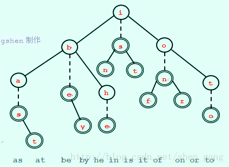

# ternary search tree

# 字典树的缺点
 不难想到，对于那些字符集特别大的字典树来说，他们的空间消耗特别大，因为每个节点都要储存大量的指针，而这些指针往往又是空的。
# 将BST与trie结合起来
 考虑这样一种树，每个节点有三个儿子，左右儿子表示自己的左右兄弟，向下的儿子表示真正的儿子。这样的树，将极大的提高了空间利用率。
<!---more-->
# 偷个图来放着
 这里插入了as,at,be,by,he....

# 三叉搜索树的插入
 考虑递归，假设我们插入到了某个节点，若下儿子与当前字符相等，则递归到下儿子并使用下一个字符来递归，如果当前字符小于下儿子，则递归到左儿子，保持当前字符不变，如果当前节点不存在了，则创建新节点，直接向下儿子走。

# 三叉搜索树的删除
 我们还是用数字来记录终结节点的终结字符串有多少个，若找到待删除的节点以后，终止与此的只有一个字符串，则直接删掉，否则让终极节点的计数器减1，注意在回溯的时候，如果三个儿子都没有终结字符了，就删掉自己。

# 三叉搜索树的查找
 递归递归。

# 三叉搜索树的缺点
 树的平衡是一个很大的问题，这个我也没办法

# 三叉搜索树的本质
 很多时候，很多数据结构像变戏法一样，我们从本质看带三叉搜索树，我们发现下儿子其实是字典树的边，在考虑左右儿子，其实这个就是bst，哈哈哈发现了没有，
 我们考虑删掉所有下儿子，你会发现，剩下的是一个bst森林，就像lct删掉指向父亲没有指向自己的边以后，就是splay森林一样，很神奇。我们将这些bst森林转化为一个一个普通的数组，让这些数组从新充当节点，然后将下儿子连回去，
 一切都清晰了，又变成普通字典树了。
 所以三叉搜索树的本质是优化后的字典树，每个节点都是一个bst。即trie套bst，外层树为trie，内层树为bst。

# 三叉搜索树的优化？
 我们让这里的bst用avl代替？用rbt代替？用sbt代替？都可以，但是我觉得这样编码太难了吧，若实在是真的差这点效率，可以去这样做，但我认为，把普通字典树的节点用avl-map、rbt-map、sbt-map直接范型编程或设为类中类不香吗。在这玩树套树确实高大上，效率也高，但编码难度也太高了。

# 代码
 先欠着，以后再还。