## 5.10. LR语法分析

经过了前面的LL语法分析，现在我们进入到了LR语法分析，LR语法分析也是一套算法，这里主要介绍两个，一个是SLR算法，领个是LR1算法。

LR语法分析本质上为从左到右自底向上算法，从左到右一个一个读入字符，然后按照产生式进行规约，直到规约出文法开始的符号。


## 5.10.1. LR算法

LR语法分析最重要的就是移入和规约。下面举一个例子来理解移入和规约。

```
加法：（
  终结符: number, +, *
  非终结符: PRODUCTION
  产生式: PRODUCTION -> number | PRODUCTION + PRODUCTION | PRODUCTION * PRODUCTION | (PRODUCTION)
  开始： PRODUCTION
```

<!-- more -->

老规矩，直接来输入`1+2*3*(4+5)`

首先输入1，这时候选择移入

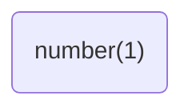

然后遇到`+`,选择规约`PRODUCTION -> number`

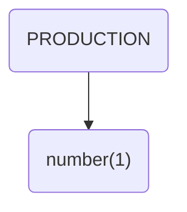

然后输入`+`,选择移入

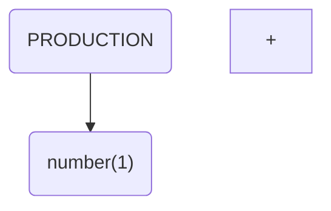

然后输入字符`2`, 选择移入

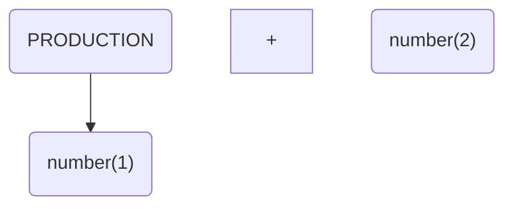

然后遇到字符`*`,选择规约 `PRODUCTION -> number`

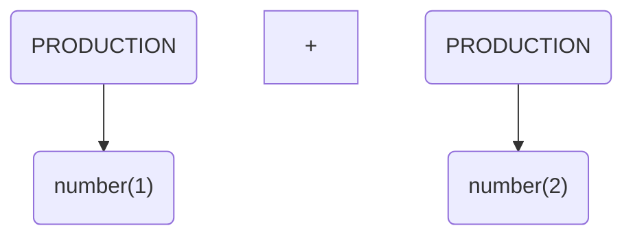

输入字符`*`, 选择移入

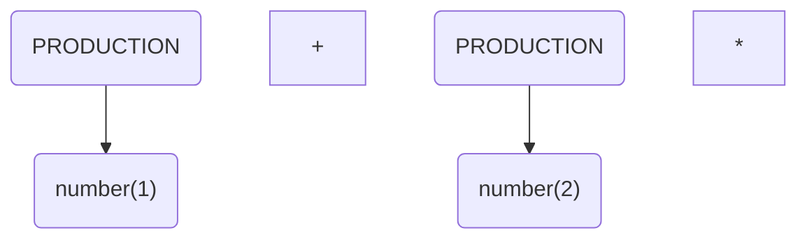

输入字符`3`,选择移入

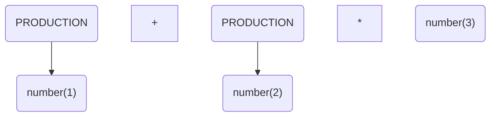


遇到字符`*`, 选择规约`PRODUCTION -> number`

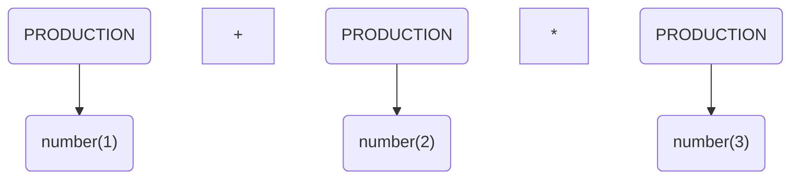

遇到字符`*`,选择规约`PRODUCTION -> PRODUCTION * PRODUCTION`

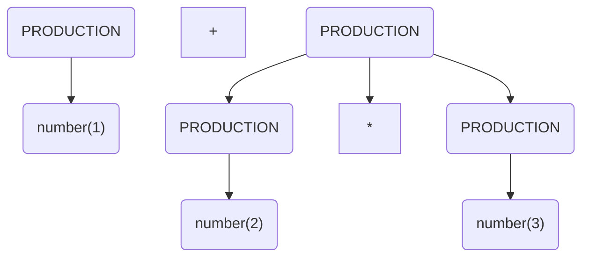

读取字符`*`,选择移入

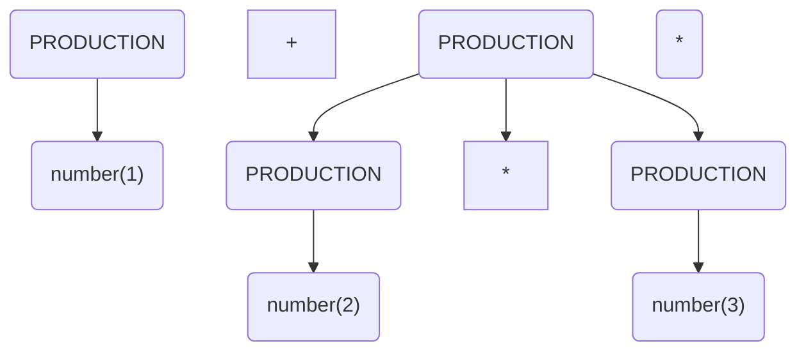

读取字符`(` 选择移入

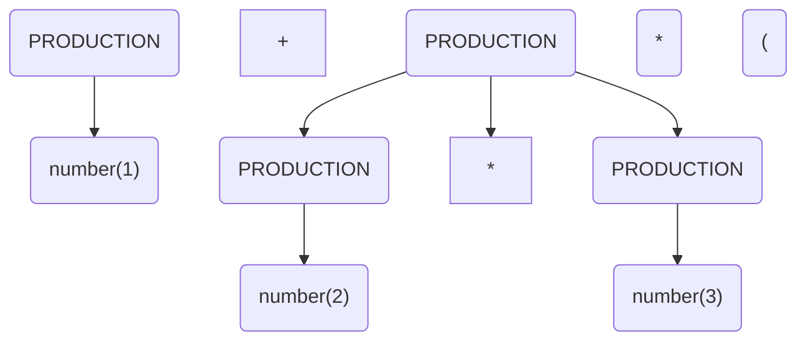

读取字符`4`, 选择移入

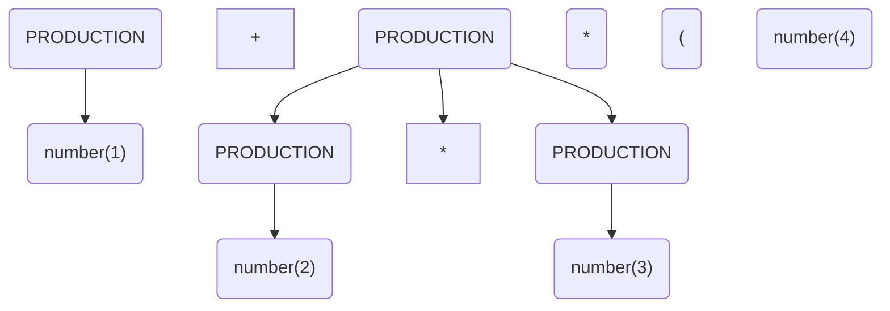

遇到字符`+`，选择规约`PODUCTION -> number`

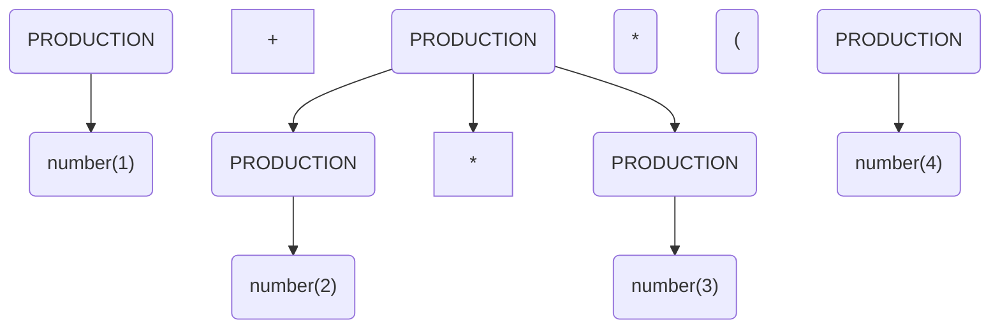

读入字符`+`, 选择移入

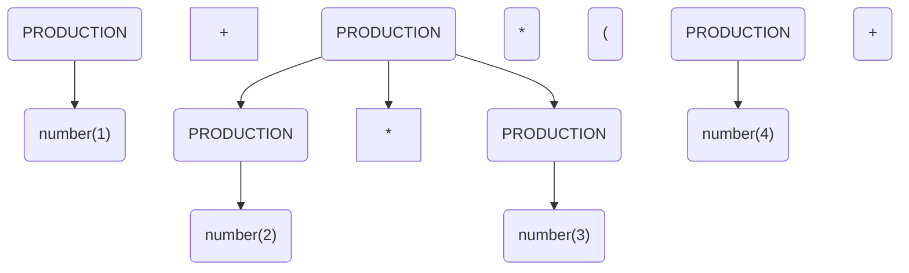

读入字符`5`, 选择移入

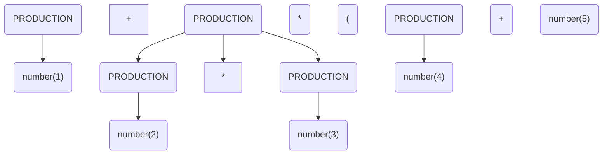

遇到字符`)`选择规约`PRODUCTION -> number`

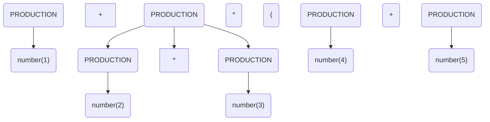

遇到字符`)`选择规约`PRODUCTION -> PRODUCTION + PRODUCTION`

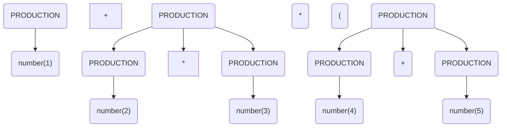

读入字符`)` , 选择移入

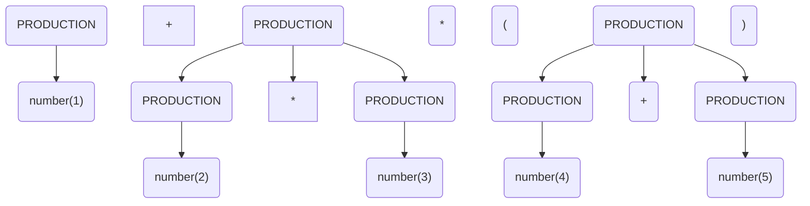

遇到字符`$`,选择规约`PRODUCTION -> ( PRODUCTION )`

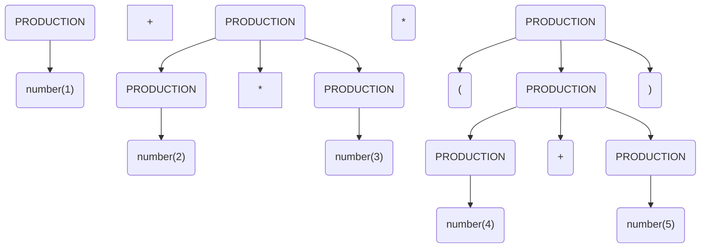

遇到字符`$`,选择规约`PRODUCTION -> PRODUCTION*PRODUCTION`

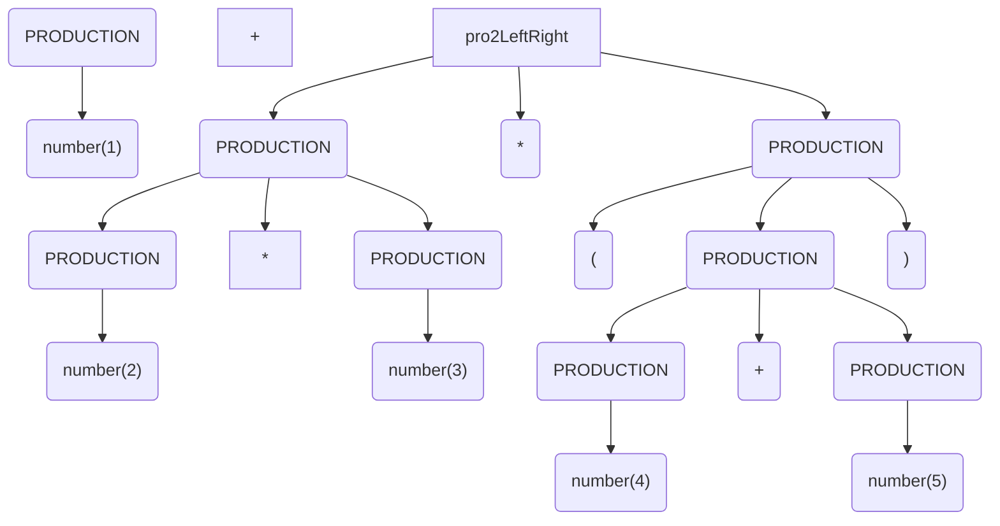

遇到字符`$`,选择规约`PRODUCTION -> PRODUCTION+PRODUCTION`


```mermaid
graph TD
  pro1("PRODUCTION") --> number("number(1)")
  +
  pro2("PRODUCTION") --> number2("number(2)")
  *
  pro3("PRODUCTION") --> number3("number(3)")
  proMum(PRODUCTION) --> pro2 & pro3 & *
  mul2("*")
  left("(")
  pro4(PRODUCTION) --> n4("number(4)")
  add2(+)
  pro5(PRODUCTION) -->n5("number(5)")
  proSum2(PRODUCTION) --> pro4 & add2 & pro5
  right(")")
  proLeftRight(PRODUCTION) --> left & proSum2 & right
  pro2LeftRight --> proLeftRight & proMum & mul2
  summm(PRODUCTION) --> pro1 & + & pro2LeftRight
```

至此，结束

## 5.10.2. 移入还是规约

现在读者应该明白，LR算法是非常强大的，但是当碰到一个字符的时候，要选择移入还是规约呢，当选择规约的时候，要用哪个产生式规约呢？

当LR分析表表明，可以同时移入和规约时，这被称为移入规约冲突

当LR分析表表明，可以同时多个产生式规约时，这被称为规约规约冲突


## 5.10.3. SLR算法介绍

SLR算法是最简单的LR算法，首先当然是需要计算FIRST集和FOLLOW集的。然后就是计算增广文法，这里涉及到项集的概念。


## 5.10.4. SLR项集

增广产生式，产生式的形式为`A -> B1 B2 B3 B4`, 他仅能代表替换规则，无法代表当前匹配到哪个地方了，增广产生式向其中加了一个标记位，用来表示当前匹配到了哪个地方。

比如`A -> · B1 B2 B3 B4`代表刚刚开始匹配，`A -> B1 · B2 B3 B4`代表已经识别了符号`B1`

借此概念，引入项集，项集就是一个产生式以及他的匹配标记位上经过产生式替换之后得到的闭包。

```
加法：
  终结符: number, +
  非终结符: SUM
  产生式: SUM -> number | SUM + number
  开始： SUM
```

开始的产生式为下文， 这里已经构成了闭包。我们定义这个产生式集合为项集1。

```
SUM -> · number
SUM -> · SUM + number
```

项集1在读入number以后，得到了项集2

```
SUM -> number ·
```

项集1在读入SUM以后，得到了项集3

```
SUM -> SUM · + number
```

项集3读入`+`以后，得到了项集4

```
SUM -> SUM + · number
```

项集4读入number以后，得到了项集5

```
SUM -> SUM + number ·
```

于是我们整理一下

```mermaid
graph TD
  I1("SUM -> · number<br/>SUM -> · SUM + number")
  I2("SUM -> number ·")
  I3("SUM -> SUM · + number")
  I4("SUM -> SUM + · number")
  I5("SUM -> SUM + number ·")
  I1 -->|number| I2
  I1 -->|SUM| I3
  I3 -->|+| I4
  I4 -->|number| I5
```


接下来我们看一个闭包的问题

```
加法乘法：
  终结符: number, +, *
  非终结符: SUM, MUL, PRODUCTION
  产生式: SUM -> PRODUCTION + MUL
  		 MUL -> MUL * number | number
  		 PRODUCTION -> SUM | MUL
  开始： PRODUCTION
```

开始的产生式为下文

```
PRODUCTION -> · SUM
PRODUCTION -> · MUL
```

但是他没有构成闭包，需要进行闭包替换，即展开标记位后的非终结符， 下文是项集1

```
PRODUCTION -> · SUM
PRODUCTION -> · MUL
SUM -> · PRODUCTION + MUL
MUL -> · MUL * number
MUL -> · number
```

项集1读入number转为项集2

```
MUL -> number ·
```

项集1读入SUM转为项集3

```
PRODUCTION -> SUM · 
```

项集1读入MUL转为项集4

```
PRODUCTION -> MUL · 
MUL -> MUL · * number
```

项集1读入PRODUCTION 转为项集5

```
SUM -> PRODUCTION · + MUL
```

项集4读入 `*`  到项集6

```txt
MUL -> MUL * · number
```

项集6读入number，得到项集7

```
MUL -> MUL * number · 
```

项集5读入+得到项集8，

```
SUM -> PRODUCTION + · MUL
MUL -> · MUL * number
MUL -> · number
```

项集8读入MUL到项集9

```
SUM -> PRODUCTION + MUL ·
MUL -> MUL · * number
```


下图是全流程

```mermaid
graph TD
  I1("状态1<br/>PRODUCTION -> · SUM<br/>PRODUCTION -> · MUL<br/>SUM -> · PRODUCTION + MUL<br/>MUL -> · MUL * number<br/>MUL -> · number")
  I2("状态2<br/>MUL -> number ·")
  I3("状态3<br/>PRODUCTION -> SUM · ")
  I4("状态4<br/>PRODUCTION -> MUL · <br/>MUL -> MUL · * number")
  I5("状态5<br/>SUM -> PRODUCTION · + MUL")
  I6("状态6<br/>MUL -> MUL * · number")
  I7("状态7<br/>MUL -> MUL * number · ")
  I8("状态8<br/>SUM -> PRODUCTION + · MUL<br/>MUL -> · MUL * number<br/>MUL -> · number")
  I9("状态9<br/>SUM -> PRODUCTION + MUL ·<br/>MUL -> MUL · * number")
  I10("状态10<br/>MUL -> number ·")
  I1 -->|number| I2
  I1 -->|SUM| I3
  I1 -->|MUL| I4
  I1 -->|PODUCTION| I5
  I4 -->|*| I6
  I6 -->|number| I7
  I5 -->|+| I8
  I8 -->|MUL| I9
  I8 -->|number| I10
  I9 -->|*| I6
  
```


## 5.10.5. SLR表生成算法


当我们计算出项集以后，就可以根据项集、FIRST集、FOLLOW集构建SLR表了，具体构造方式如下，对于项集中的每个项，就是SLR表的行，也即状态。这次我们直接看这个复杂的例子(见6.10.4)

```
加法乘法：
  终结符: number, +, *
  非终结符: SUM, MUL, PRODUCTION
  产生式: SUM -> PRODUCTION + MUL
  		 MUL -> MUL * number | number
  		 PRODUCTION -> SUM | MUL
  开始： PRODUCTION
```


状态中的边就对应着移入，下面我们首先按照边填充所有的移入指令,移入指令针对于终结符，状态1下的s2,就对应着移入字符number，然后跳转到状态2


| 状态 | number |  +   |  *   | SUM  | MUL  | PRODUCTION |  $   |
| :--: | :----: | :--: | :--: | :--: | :--: | :--------: | :--: |
|  1   |   s2   |      |      |      |      |            |      |
|  2   |        |      |      |      |      |            |      |
|  3   |        |      |      |      |      |            |      |
|  4   |        |      |  s6  |      |      |            |      |
|  5   |        |  s8  |      |      |      |            |      |
|  6   |   s7   |      |      |      |      |            |      |
|  7   |        |      |      |      |      |            |      |
|  8   |  s10   |      |      |      |      |            |      |
|  9   |        |      |  s6  |      |      |            |      |
|  10  |        |      |      |      |      |            |      |


然后按照边填充goto，对于非终结符，按照边进行填写（和移入一致），goto3意味着状态1下，碰到SUM后，跳转到状态3

| 状态 | number |  +   |  *   |  SUM  |  MUL  | PRODUCTION |  $   |
| :--: | :----: | :--: | :--: | :---: | :---: | :--------: | :--: |
|  1   |   s2   |      |      | goto3 | goto4 |   goto5    |      |
|  2   |        |      |      |       |       |            |      |
|  3   |        |      |      |       |       |            |      |
|  4   |        |      |  s6  |       |       |            |      |
|  5   |        |  s8  |      |       |       |            |      |
|  6   |   s7   |      |      |       |       |            |      |
|  7   |        |      |      |       |       |            |      |
|  8   |  s10   |      |      |       | goto9 |            |      |
|  9   |        |      |  s6  |       |       |            |      |
|  10  |        |      |      |       |       |            |      |

第三步注意到状态3和状态4较为特殊，他们包含了终结态，所以在状态3和状态4下输入`$`则表明识别完成

| 状态 | number |  +   |  *   |  SUM  |  MUL  | PRODUCTION |  $   |
| :--: | :----: | :--: | :--: | :---: | :---: | :--------: | :--: |
|  1   |   s2   |      |      | goto3 | goto4 |   goto5    |      |
|  2   |        |      |      |       |       |            |      |
|  3   |        |      |      |       |       |            | ACC  |
|  4   |        |      |  s6  |       |       |            | ACC  |
|  5   |        |  s8  |      |       |       |            |      |
|  6   |   s7   |      |      |       |       |            |      |
|  7   |        |      |      |       |       |            |      |
|  8   |  s10   |      |      |       | goto9 |            |      |
|  9   |        |      |  s6  |       |       |            |      |
|  10  |        |      |      |       |       |            |      |

最后一步，根据FOLLOW集处理规约，先想想规约是什么，就是碰到一个无法识别的字符以后，需要将以前的数据进行规约，状态2，3，4，7，9，10都存在规约的情况，

先来计算FOLLOW集，能发现MUL的FOLLOW集为`*, +,$`, SUM的FOLLOW集为`+,$`，PRODUCTION的FOLLOW集为`+,$`


先看状态2，明显可以使用产生式`MUL -> number`规约，但是在状态2碰到哪些字符才能规约呢？其实就是MUL的FOLLOW集,于是有了下表,r代表规约，其右边的括号内写着产生式

| 状态 | number |       +        |       *        |  SUM  |  MUL  | PRODUCTION |       $        |
| :--: | :----: | :------------: | :------------: | :---: | :---: | :--------: | :------------: |
|  1   |   s2   |                |                | goto3 | goto4 |   goto5    |                |
|  2   |        | r(MUL->number) | r(MUL->number) |       |       |            | r(MUL->number) |
|  3   |        |                |                |       |       |            |      ACC       |
|  4   |        |                |       s6       |       |       |            |      ACC       |
|  5   |        |       s8       |                |       |       |            |                |
|  6   |   s7   |                |                |       |       |            |                |
|  7   |        |                |                |       |       |            |                |
|  8   |  s10   |                |                |       | goto9 |            |                |
|  9   |        |                |       s6       |       |       |            |                |
|  10  |        |                |                |       |       |            |                |


后面的状态3，4，7，9，10同理了，剩下的没有填充的地方就是报错了，注意到状态2和3，碰到`$`时要特殊判断，直接ACC


| 状态 | number |             +              |            *            |  SUM  |  MUL  | PRODUCTION |             $              |
| :--: | :----: | :------------------------: | :---------------------: | :---: | :---: | :--------: | :------------------------: |
|  1   |   s2   |                            |                         | goto3 | goto4 |   goto5    |                            |
|  2   |        |       r(MUL->number)       |     r(MUL->number)      |       |       |            |       r(MUL->number)       |
|  3   |        |    r(PRODUCTION -> SUM)    |                         |       |       |            |            ACC             |
|  4   |        |    r(PRODUCTION -> MUL)    |           s6            |       |       |            |            ACC             |
|  5   |        |             s8             |                         |       |       |            |                            |
|  6   |   s7   |                            |                         |       |       |            |                            |
|  7   |        |  r(MUL -> MUL * number )   | r(MUL -> MUL * number ) |       |       |            |  r(MUL -> MUL * number )   |
|  8   |  s10   |                            |                         |       | goto9 |            |                            |
|  9   |        | r(SUM -> PRODUCTION + MUL) |           s6            |       |       |            | r(SUM -> PRODUCTION + MUL) |
|  10  |        |       r(MUL->number)       |     r(MUL->number)      |       |       |            |       r(MUL->number)       |


接下来我们根据SLR表来跑一下LR算法验证一下输入`1+2*3`

| 步骤 | 状态                                   | 操作                                                         | 状态栈               | 符号栈                               |
| ---- | -------------------------------------- | ------------------------------------------------------------ | -------------------- | ------------------------------------ |
| 1    |                                        | 最开始有一个状态栈，其中包含状态1<br />一个符号栈，为空      | `[栈底,1]`           | ` [栈底]`                            |
| 2    | 从状态栈顶读取状态<br />现在位于状态1  | 读入字符`number1`, 执行`s2` <br />则状态2入栈，字符number1入栈 | `[栈底,1,2]`         | `[栈底,number1]`                     |
| 3    | 从状态栈顶读取状态<br />现在位于状态2  | 遇到字符`+`不读入, 执行`r(MUL->number)` <br />状态栈弹出状态2，符号栈弹出`number1`<br />然后`MUL`符号准备入栈, 入栈时状态栈顶为1<br />于是执行`goto4` | `[栈底,1,4]`         | `[栈底,MUL]`                         |
| 4    | 从状态栈顶读取状态<br />现在位于状态4  | 遇到字符`+`不读入, 执行`r(PRODUCTION -> MUL)`<br /> 状态4弹出，符号MUL弹出，<br />然后PRODUCTION符号准备入栈，此时栈顶为1 <br />于是执行`goto5` | `[栈底,1,5]`         | `[栈底,PRODUCTION]`                  |
| 5    | 从状态栈顶读取状态<br />现在位于状态4  | 读入字符`+`， 执行`s8`                                       | `[栈底,1,5,8]`       | ` [栈底,PRODUCTION,+]`               |
| 6    | 从状态栈顶读取状态<br />现在位于状态8  | 读入字符`number2`,执行`s10`                                  | `[栈底,1,5,8,10]`    | ` [栈底,PRODUCTION,+,number2]`       |
| 7    | 从状态栈顶读取状态<br />现在位于状态10 | 遇到字符`*`不读入,于是弹栈、`goto9`                          | `[栈底,1,5,8,9]`     | ,`[栈底,PRODUCTION,+,MUL]`           |
| 8    | 从状态栈顶读取状态<br />现在位于状态9  | 读入字符`*`，执行`s6`                                        | `[栈底,1,5,8,9,6]`   | ` [栈底,PRODUCTION,+,MUL,*]`         |
| 9    | 从状态栈顶读取状态<br />现在位于状态6  | ,读入字符`number3`， 执行`s7`                                | `[栈底,1,5,8,9,6,7]` | ` [栈底,PRODUCTION,+,MUL,*,number3]` |
| 10   | 从状态栈顶读取状态<br />现在位于状态7  | 遇到字符`$`不读入,执行`r(MUL -> MUL * number )`<br />符号栈弹出三个，状态栈弹出三个<br />然后处于状态8，按照发现遇到MUL<br />执行`goto9` | `[栈底,1,5,8,9] `    | `[栈底,PRODUCTION,+,MUL]`            |
| 11   | 从状态栈顶读取状态<br />现在位于状态9  | 遇到字符`$`不读入, 执行`r(SUM -> PRODUCTION + MUL)`<br />两个栈都是弹出三个，处于状态1<br />遇到SUM,执行`goto3` | `[栈底,1,3] `        | `[栈底,SUM]`                         |
| 12   | 从状态栈顶读取状态<br />现在位于状态3, | 读入字符`$`，结束                                            |                      |                                      |


## 5.10.6 SLR算法伪代码

1. 构造文法的规范LR(0) 项集簇 C = ${I_0, I_1, ... I_n}$. 
2. 对于状态i，  
   ① 如果[A->α·aβ]在状态中，a为终结符且GOTO(i,a)=j， 则ACTION[i,a]为: "移入j"   
   ② 如果[A->α·]在状态中且A不为开始符号，则对于所有的FOLLOW(A)的字符a，将ACTION[i,a]设为: "规约A->α"  
   ③ 如果[A->α·]在状态中且A为开始符号，则将ACTION[i,$]设为: "接受" 
3. 对于状态i，如果A为非终结符且 GOTO(i,A)=j 则GOTO[i,A]=j 
4. 剩下的地方就是报错 5. 起点是[S'->·S]

## 5.10.7 冲突与规约

由于SLR文法很简单，他能识别的文法其实很少很少，大部分文法在他这里都会冲突，也就是一张SLR表中，一个状态遇到了同一个符号时，表要求进行多种操作。

但是SLR文法也容易实现，所以在笔者的compiler项目中，很多地方都直接执行了SLR算法

所以我们还需要对文法进行进一步增广，后面提出LR1算法。


## 5.10.8 LR1 增广文法

LR1在SLR的基础上继续进行增广，继续引入了end集合，下面继续回忆一下文法和项集

```
加法乘法：
  终结符: number, +, *
  非终结符: SUM, MUL, PRODUCTION
  产生式: SUM -> PRODUCTION + MUL
  		 MUL -> MUL * number | number
  		 PRODUCTION -> SUM | MUL
  开始： PRODUCTION
```


```mermaid
graph TD
  I1("状态1<br/>PRODUCTION -> · SUM<br/>PRODUCTION -> · MUL<br/>SUM -> · PRODUCTION + MUL<br/>MUL -> · MUL * number<br/>MUL -> · number")
  I2("状态2<br/>MUL -> number ·")
  I3("状态3<br/>PRODUCTION -> SUM · ")
  I4("状态4<br/>PRODUCTION -> MUL · <br/>MUL -> MUL · * number")
  I5("状态5<br/>SUM -> PRODUCTION · + MUL")
  I6("状态6<br/>MUL -> MUL * · number")
  I7("状态7<br/>MUL -> MUL * number · ")
  I8("状态8<br/>SUM -> PRODUCTION + · MUL<br/>MUL -> · MUL * number<br/>MUL -> · number")
  I9("状态9<br/>SUM -> PRODUCTION + MUL ·<br/>MUL -> MUL · * number")
  I10("状态10<br/>MUL -> number ·")
  I1 -->|number| I2
  I1 -->|SUM| I3
  I1 -->|MUL| I4
  I1 -->|PODUCTION| I5
  I4 -->|*| I6
  I6 -->|number| I7
  I5 -->|+| I8
  I8 -->|MUL| I9
  I8 -->|number| I10
  I9 -->|*| I6
  
```


关注状态1· 

```
PRODUCTION -> · SUM
PRODUCTION -> · MUL
SUM -> · PRODUCTION + MUL
MUL -> · MUL * number
MUL -> · number
```

对于其中的`PRODUCTION -> · SUM`，我们发现，其后紧跟着的因该是`$`，  

由`SUM -> · PRODUCTION + MUL`得出，`PRODUCTION -> · SUM`后可为`+`

注意产生式`MUL -> · number`，他的后面是`*`

```
PRODUCTION -> · SUM, $/+
PRODUCTION -> · MUL, $/+
SUM -> · PRODUCTION + MUL, $/+
MUL -> · MUL * number, $/+
MUL -> · number, *
```


然后是状态2

```
MUL -> number · , *
```

状态3

```
PRODUCTION -> SUM · , $/+
```

状态4

```
PRODUCTION -> MUL · , $/+
MUL -> MUL · * number, $/+
```

状态5

```
SUM -> PRODUCTION · + MUL, $/+
```

状态8

```
SUM -> PRODUCTION + · MUL, $/+
MUL -> · MUL * number, $/+
MUL -> · number, *
```

状态9

```
SUM -> PRODUCTION + MUL · , $/+
MUL -> MUL · * number, $/+
```

状态10

```
MUL -> number · , *
```

状态6

```
MUL -> MUL * · number, $/+
```

状态7

```
MUL -> MUL * number ·, $/+
```


```mermaid
graph TD
  I1("状态1<br/>PRODUCTION -> · SUM, $/+<br/>PRODUCTION -> · MUL, $/+<br/>SUM -> · PRODUCTION + MUL, $/+<br/>MUL -> · MUL * number, $/+<br/>MUL -> · number, *")
  I2("状态2<br/>MUL -> number · , *")
  I3("状态3<br/>PRODUCTION -> SUM · , $/+")
  I4("状态4<br/>PRODUCTION -> MUL · , $/+<br/>MUL -> MUL · * number, $/+")
  I5("状态5<br/>SUM -> PRODUCTION · + MUL, $/+")
  I6("状态6<br/>MUL -> MUL * · number, $/+")
  I7("状态7<br/>MUL -> MUL * number ·, $/+")
  I8("状态8<br/>SUM -> PRODUCTION + · MUL, $/+<br/>MUL -> · MUL * number, $/+<br/>MUL -> · number, *")
  I9("状态9<br/>SUM -> PRODUCTION + MUL ·, $/+<br/>MUL -> MUL · * number, $/+")
  I10("状态10<br/>MUL -> number ·, *")
  I1 -->|number| I2
  I1 -->|SUM| I3
  I1 -->|MUL| I4
  I1 -->|PODUCTION| I5
  I4 -->|*| I6
  I6 -->|number| I7
  I5 -->|+| I8
  I8 -->|MUL| I9
  I8 -->|number| I10
  I9 -->|*| I6
  
```


## 5.10.9 LR1表生成算法伪代码

当读者理解了SLR表生成的伪代码后，LR1迎刃而解，只有2.2不一样， 可以发现LR1甚至都不需要使用FOLLOW集。

1. 构造文法的规范LR(0) 项集簇 C = ${I_0, I_1, ... I_n}$. 
2. 对于状态i，  
   ① 如果[A->α·aβ]在状态中，a为终结符且GOTO(i,a)=j， 则ACTION[i,a]为: "移入j"   
   ② 如果[A->α·]在状态中且A不为开始符号，则对于**此时的增广文法中的end集**的字符a，将ACTION[i,a]设为: "规约A->α"  
   ③ 如果[A->α·]在状态中且A为开始符号，则将ACTION[i,$]设为: "接受" 
3. 对于状态i，如果A为非终结符且 GOTO(i,A)=j 则GOTO[i,A]=j 
4. 剩下的地方就是报错 5. 起点是[S'->·S]

## 5.10.10 LR1算法与SLR算法比较

可以看到LR1算法比SLR算法更加严格，LR1的end集往往会比FOLLOW集中的字符少。

## 5.10.11 二义性文法

回到最初的起点，LR算法使用移入和规约来完成语法树的构建，如果文法二义，则对于所生成的LR分析表，会有冲突的现象，即同时要求移入和规约，或者要求使用多种产生式进行规约，这时候一种解决办法是消除二义性，但是消除二义性的代价太高，往往导致文法难以理解。

于是可以采取另一种方案，例如指定优先级。

二义例子1,移入规约冲突

```
ifelse:
  终结符: if, else, condition, block
  非终结符: target
  产生式: target -> block | if condition target | if condition target else target
  开始： target
```

在面对这个文法时，在碰到终结符`else`时，` target -> if condition target`要求规约，`target -> if condition target else target`而要求移入，实际上，正确的做法为要求移入，所以我们只需要给前一个产生式更高的优先级即可解决问题。


二义例子2,移入规约冲突

```
加法：
  终结符: number, +
  非终结符: SUM
  产生式: SUM -> number | SUM + SUM
  开始： SUM
```

当栈中已有1+2后，如果又碰到了加号，这时候时移入还是规约呢？ 对于左结合性文法，应该选择规约，对于右结合性文法，应该选择移入。

二义例子3， 移入规约冲突

```
加法乘法：
  终结符: number, +
  非终结符: E
  产生式: E -> number | E + E | E * E
  开始： E
```

当栈中已有1+2后，如果又碰到了乘号， 这是要移入还是规约呢，`E->E +E `要求规约,`E->E * E `要求移入,这时应该选择移入, 即给后者更高的优先级。


## 5.10.12 总结


至此，大部分二义性问题已被解决，编译器的前端流程也以语法树的成功生成而告一段落了。


